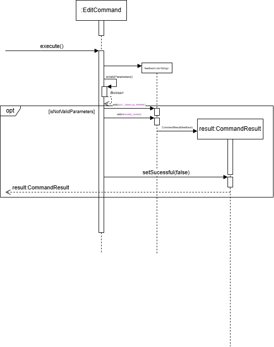

# InternSprint Developer Guide

## Table of Contents

<!-- TOC -->
* [**Acknowledgements**](#acknowledgements)
* [**Setting Up and Getting Started**](#setting-up-and-getting-started)
* [**Design**](#design)
  * [Architecture](#architecture)
  * [UI Component](#ui-component)
  * [Logic Component](#logic-component)
  * [Model Component](#model-component)
  * [Storage Component](#storage-component)
* [**Implementation**](#implementation)
  * [Commands](#commands)
    * [1. Add new Internship](#1-add-new-internship)
    * [2. Edit an Internship](#2-edit-an-internship)
    * [3. Delete an Internship](#3-delete-an-internship)
    * [4. List all Internships](#4-list-all-internships)
* [**Documentation, logging, testing, configuration and deployment**](#documentation-logging-testing-configuration-and-deployment)
* [**Product scope**](#product-scope)
  * [Target user profile](#target-user-profile)
  * [Value proposition](#value-proposition)
* [**User Stories**](#user-stories)
* [**Non-Functional Requirements**](#non-functional-requirements)
* [**Glossary**](#glossary)
* [**Instructions for manual testing**](#instructions-for-manual-testing)

## Acknowledgements

{list here sources of all reused/adapted ideas, code, documentation, and third-party libraries -- include links to the original source as well}

**Third party libraries used:**

* [JSON in Java](https://mvnrepository.com/artifact/org.json/json): Used to store and retrieve data from JSON files.
* [PrettyTime](https://mvnrepository.com/artifact/org.ocpsoft.prettytime/prettytime): 
Used to format timestamps in a human-readable format.
* [Natty](https://mvnrepository.com/artifact/com.joestelmach/natty): 
Used to parse natural language date and time strings.
* [ASCII Table](https://mvnrepository.com/artifact/de.vandermeer/asciitable): Use to render tabular view of information 
in UI for user profile and projects.

## Setting Up and Getting Started
> **Caution:**
Follow the steps in the following guide precisely. Things will not work out if you deviate in some steps.

First, **fork** this repo, and **clone** the fork into your computer.

If you plan to use Intellij IDEA (highly recommended):

1. **Configure the JDK**: 
Follow the guide [[se-edu/guides] IDEA: Configuring the JDK](https://se-education.org/guides/tutorials/intellijJdk.html)
to ensure Intellij is configured to use **JDK 17**.
2. **Import the project as a Gradle project**:
Follow the guide [[se-edu/guides] IDEA: Importing a Gradle project]
(https://se-education.org/guides/tutorials/intellijImportGradleProject.html) to import the project into IDEA.
> Note: Importing a Gradle project is slightly different from importing a normal Java project.
3. **Verify the setup:**
   * Run the `seedu.internsprint.InternSprint` and try a few commands.
   * Run the tests in the `src/test` directory to ensure everything is working as expected.

## Design

> **Tip:** The diagrams are created using [drawio](https://app.diagrams.net/). 
> Refer to their website for more information.

### Architecture

{Describe the design and implementation of the product. Use UML diagrams and short code snippets where applicable.}

The **Architecture Diagram** above shows the high-level implementation of the InternSprint application.

Given below is a quick overview of our main components and their interactions.

**Main Components:**

{Explain briefly the packaging structure and the main components of the product.}

**How the components interact:**

The *Sequence Diagram* below shows how the components interact with each other when a user deletes an internship by 
issuing the command `delete /index 1`.

{Insert Sequence diagram here and explanation here}

### UI Component

The UI component is responsible for handling user input and output.

{Explain in better detail}

### Logic Component

Here is a partial class diagram of the Logic component:

**CommandParser**

_Input Parsing:_ The `CommandParser` class takes a single line of user input and splits it into a command word and
key value pairs.
* The command word is used to determine the type of command that needs be executed, and creates the corresponding
  `Command` object (e.g., `AddCommand`, `DeleteCommand`, `ListCommand`).
* The key value pairs are stored in a `HashMap<String, String>` of the `Command` object. The key value pairs are
  validated only during command execution in `isValidParameters()` method.

Here is the partial class diagram of the `CommandParser` class. The multiplicities of `*command` classes are 0 or 1,
because the dependency is formed only when the command is executed.

Insert command class diagram here

{Insert partial class diagram here and explain in detail}

### Model Component

The **Model** component is responsible for storing and managing and providing access to all the data used by the 
InternSprint . It represents the internal state of the application and is updated based on commands entered by the user.

---

#### ⚙️ Responsibilities
- Store internship information (company name, role, description, etc.)
- Support three internship types: Software, Hardware and General.
- Store and manage interviews (including multiple rounds per internship)
- Handle user information and goals via the `UserProfile`

---
#### 📦 Package Structure

```
model
├── internship
│   ├── Interview.java          # Represents a single interview (including optional rounds)
│   ├── InterviewEntry.java     # Wrapper class pairing an Interview with its Internship
│   ├── GeneralInternship.java  # Internship subclass for general roles
│   ├── HardwareInternship.java # Internship subclass for hardware roles
│   ├── SoftwareInternship.java # Internship subclass for software roles
│   ├── Internship.java         # Abstract class defining an internship's structure
│   └── InternshipList.java     # Contains and manages the internship collection
└── userprofile
    └── UserProfile.java        # Stores user preferences (companies, roles, goals, etc.)
```
---

#### 🧱 Key Classes and Their Roles

| Class                                 | Role                                                              |
|---------------------------------------|-------------------------------------------------------------------|
| `Internship`                          | Abstract base class for internships                               |
| `General/Software/HardwareInternship` | Specific implementations depending on type                        |
| `InternshipList`                      | Stores internships in a HashMap by category (`software`, etc.)    |
| `Interview`                           | Represents one interview round, with optional next rounds         |
| `InterviewEntry`                      | A wrapper for pairing an `Interview` with its parent `Internship` |
| `UserProfile`                         | Stores user preferences for use across the application            |

---

### Storage Component

The Storage component is responsible for reading and writing data to and from the disk.

{Explain in better detail}

## Implementation

This section describes some noteworthy details on how certain features are implemented.

### Commands

The `Command` class is an abstract class that represents a command that the user can execute.
It provides an additional layer of abstraction between the user input and the actual execution of the command,
achieving the **SoC (Separation of Concerns)** design principle.

The partial class structure of the `Command` class is shown below:

Insert command class diagram here

The abstract `Command` class has the following abstract methods:
* `isValidParameters()`: Validates the parameters of the command.
* `execute(InternshipList internships, UserProfile user)`: Executes the command.

### 1. Add new Internship

**Overview**:

This command allows the user to add a new internship to the list of internships. The new internship is immediately added
to the `internships.txt` file at `../data/internships.txt`.

**How the feature is implemented:**

* The `AddCommand` class is an abstract class extends from the abstract class `Command`.
* The user can specify the type of internship as `general`, `software` or `hardware` as input.
Each type of internship has a separate class that extends the `AddCommand` class, 
`AddGeneralCommand`, `AddSoftwareCommand`, and `AddHardwareCommand`.
* These subclasses override the `isValidParameters()` and `execute()` methods to validate the parameters of the command,
depending on the type of internship.
* The `execute()` method of adds the internship to the list of internships stored in `InternshipList` which it obtains
as a parameter.
  * `InternshipList` class stores the list of internships as a HashMap. Each type of `*AddCommand` will insert the
  internship into the correct list.

**Why is it implemented this way:**

* By abstracting each type of internship into a separate class, the code achieves **SoC (Separation of Concerns)** 
design principle.
* Each subclass is now responsible for validating and executing the command for a specific type of internship, enabling
testing and debugging to be more focused and efficient.

**Alternatives Considered:**
* **Alternative 1 (Current choice):** Use separate classes for each type of internship.
  * Pros: Achieves **SoC (Separation of Concerns)** design principle.
  * Cons: Requires additional classes and code to be written.

* **Alternative 2:** Use a single `AddCommand` class and use a switch statement to determine the type of internship.
  * Pros: Reduces the number of classes and code to be written.
  * Cons: Violates the **SRP (Single Responsibility Principle)**.
* **Alternative 3:** Use a single `AddCommand` class and store the type of internship as a field in the `Internship`.
  * Pros: Reduces the number of classes and code to be written.
  * Cons: Requires additional validation to ensure that the type of internship is consistent with the parameters provided
  by the user.

**Sequence Diagram:**

Below is the sequence diagram for adding a new software internship. A similar sequence is followed for adding a general
or hardware internship.

Add sequence diagram for adding a software internship here

### 2. Edit an Internship

**Overview**:

This command allows the user to edit the parameters of their prexisting internship in their list. This update  
is immediately added to the `internships.txt` file at `../data/internships.txt`.

**How the feature is implemented:**

* The `EditCommand` class is an abstract class extends from the abstract class `Command`.
* The user can specify different parameters they could edit: both the basic parameters for `general`, `software` or 
`hardware` internships and additional extended parameters through the use of flags. All parameters are optional 
and can be used on an as-needed basis.
* The mandatory flag `/index` is required to be entered by the user, and checked for in `isValidParameters()`.
This method also checks if all flags entered by user are predefined in `POSSIBLE_PARAMETERS` set.
* The `execute()` method calls `editParametersForFoundInternships()` to validates the `\tech` and `\hardtech` 
parameters of the command, depending on the type of internship and sets the edited parameters accordingly
  * `parameters` is stored as key-value pairs(hash-map) within Command super class.

**Why is it implemented this way:**
* By making use of the `edit /index` format here, instead of `edit general /index` we aimed to make the user experience
for simpler and more intuitive to understand. It may become tedious for the user to continue to retype lengthy 
internship type every time, especially since the `list` command enumerates all internships as one list cohesively.
This approach to improve simplicity and cohesion of updating internship list is maintained in other commands such as 
`delete`.
* By providing the user a range of possible extended parameters to edit and add, their experience is more streamlined
in that when creating an internship they are limited to adding the necessary information, but more advanced users 
can extend these capabilities through keys like `/status` or `/desc` for status and description respectively.


**Alternatives Considered:**
* **Alternative 1 (Current choice):** Use a single `EditCommand` class and allow user to edit the extended set of 
optional parameters using flags
  * Pros: Simpler, user-friendly command-line interface
  * Cons:Requires additional validation to ensure that the type of internship is consistent with the parameters provided
    by the user.

* **Alternative 2:** Only allow user to edit the same set of parameters used when creating the internship
  * Pros: Reduces the number of parameter checking, getting and setting code to be written.
  * Cons: This limits the functionality for our users and the information that can be entered for each internship.
* **Alternative 3:** Use separate classes for each type of internship.
  * Pros: Achieves **SoC (Separation of Concerns)** design principle.
  * Cons: Requires additional classes and code to be written.

**Sequence Diagram:**

Below is the sequence diagram for adding a new software internship. A similar sequence is followed for adding a general
or hardware internship.



### 3. Delete an Internship

**Overview**:

This command allows the user to delete an internship from the list of internships. The deleted internship is 
immediately removed from the `internships.txt` file at `../data/internships.txt`.

**How the feature is implemented:**

* The `DeleteCommand` class is an abstract class extends from the abstract class `Command`. 
* The user is required to specify the `/index` flag, which is a mandatory parameter to indicate which internship 
should be deleted.
* The `isValidParameters()` method ensures that the required `/index` flag is provided by the user before proceeding 
with execution. 
* The `execute()` method retrieves the internship entry from the internship list based on the provided index. 
It then removes the internship entry from the list and attempts to save the updated internship list.
Feedback messages indicating success or failure, including errors such as missing or invalid indices are returned.
  * `index parameter` is stored as a key-value pair in the `parameters` Hashmap.
   
**Why is it implemented this way:**

* The /index flag is made mandatory to ensure users specify exactly which internship to delete, 
preventing accidental removals.
* By making use of the `delete /index` format here, instead of `delete general /index` we aimed to make the user 
experience for simpler and more intuitive to understand. It may become tedious for the user to continue to retype 
lengthy internship type every time, especially since the `list` command enumerates all internships as 
one list cohesively. This approach to improve simplicity and cohesion of updating internship list 
is maintained in other commands such as `edit`.

**Alternatives Considered:**
* **Alternative 1 (Current choice):** Use a single `DeleteCommand` class and allow user to delete an internship from
the internship list.
  * Pros: Simpler, user-friendly command-line interface
  * Cons: Deletion is irreversible, meaning accidental deletions cannot be undone without re-entering 
the internship details manually.

* **Alternative 2:** Use separate classes for each type of internship.  
  * Pros: Achieves **SoC (Separation of Concerns)** design principle.
  * Cons: Requires additional classes and code to be written.

**Sequence Diagram:**

Below is the sequence diagram for deleting an internship.
Add sequence diagram for deleting an internship here.

### 4. List all Internships

## Documentation, logging, testing, configuration and deployment

## Product scope

### Target user profile

This product is designed for NUS Computer Engineering undergraduates, especially students applying for internships 
or jobs for the first time. It caters to those who prefer a unified CLI-based platform over a GUI, streamlining 
job application processes for tech-savvy users who value automation and command-line control.

### Value proposition

The product helps CEG students effortlessly track and maintain job applications at different stages using short 
commands, all within a unified CLI. Stay organized, save time, and streamline the application process with automation, 
ensuring a seamless and efficient job hunt.

## User Stories

| Version | As a ...    | I want to ...                                                      | So that I can ...                                                                                     |
|---------|-------------|--------------------------------------------------------------------|-------------------------------------------------------------------------------------------------------|
| v1.0    | New user    | View the user command guide easily                                 | learn more about the product as and when needed, and know how to work with the software               |
| v1.0    | Normal user | Add the job role, company and status of the job I have applied for | easily identify where I have applied                                                                  |
| v1.0    | Normal user | List all the jobs I have applied for                               | track my progress and have a masterlist reference of my applications                                  |
| v1.0    | Normal user | Delete certain job applications                                    | only see relevant data in the list                                                                    |
| v1.0    | Normal user | View the detailed job description                                  | have a better understanding of the role I am applying for                                             |
| v1.0    | Normal user | Save the previously stored data about the jobs I have applied to   | reopen the application and have my old data restored so I don't have to reenter everything repeatedly |
| v2.0    | New user    |                                                                    |                                                                                                       |

## Non-Functional Requirements

{Give non-functional requirements}
* Should work on any *mainsteam OS* as long as it has Java 17 or above installed.
* A user with above average typing speed for regular English text (i.e. not code, not system admin commands) should be 
able to accomplish most of the tasks faster using commands than using a mouse.

## Glossary

* *glossary item* - Definition
* *Mainstream OS* - Windows, Linux, Unix, MacOS

## Instructions for manual testing

{Give instructions on how to do a manual product testing e.g., how to load sample data to be used for testing}

> **Note:** These instructions only provide a starting point for testers to work on; testers are expected to do more 
> exploratory testing.

### 1. Start InternSprint Application

1. Follow the instructions given in our 
[User Guide Quick Start](https://ay2425s2-cs2113-t11a-3.github.io/tp/UserGuide.html#quick-start)
 to set up the application.

2. Expected: A welcome message and a prompt for user input.

### 2. Test Cases

**2.1 Initial State**

**2.2 Add a new internship**

**2.3 List all internships**

**2.4 Delete an internship**

**2.5 Edit an internship**

**2.7 Describe an internship**

